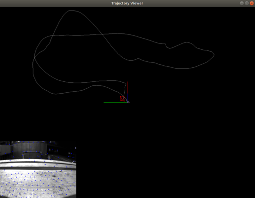
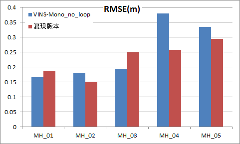

# 背景
本项目是以[VINS-Mono](https://github.com/HKUST-Aerial-Robotics/VINS-Mono)为基础代码，移除ROS及Ceres依赖，使用自定义的图优化器进行系统初始化和后端优化。图优化器的部分代码参考[VINS-Course](https://github.com/HeYijia/VINS-Course)和[g2o](https://github.com/RainerKuemmerle/g2o/)。
# 相对参考代码的变化点
<相对VINS-Mono> 
1. 本项目是VINS-Mono的简单实现，不包括闭环检测模块，只实现系统初始化和视觉&IMU融合定位等基础功能。
2. 本项目不依赖ROS和Ceres优化库。
* 使用自定义结构体代替ROS进行image和imu消息发布。 
* 使用pangolin代替rviz绘制轨迹。 
* 使用自定义的图优化后端代替Ceres进行优化。  

<相对VINS-Course> 
1. 将LM算法独立出来并追加接口，以方便后期扩展。
2. 修改节点和边的部分接口函数，调整先验信息的导入导出方式。
3. 系统初始化模块也使用自定义图优化器完成，彻底移除Ceres依赖。
# 系统界面
  
# 测试结果
将复现系统与VINS-Mono（不开启闭环检测）进行对比测试，结果如下：
1. 精度（RMSE）处于同等水平。<-- 因为采用与VINS-Mono相同的耦合和优化策略。
2. 实时性稍差。 <--自定义图优化器没有进行加速处理，优化速度较慢。

<详细结果>  
数据集： [EuRoc MH公开数据集](https://projects.asl.ethz.ch/datasets/doku.php?id=kmavvisualinertialdatasets)  
评估工具： [evo](https://github.com/MichaelGrupp/evo)

* RMSE  
  

* 轨迹  

